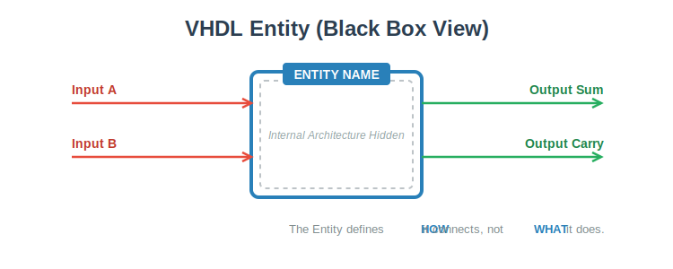
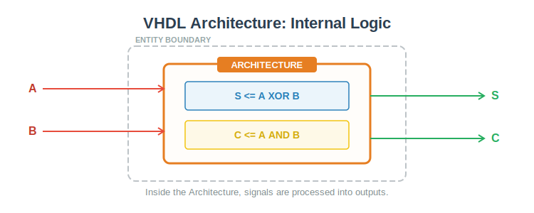
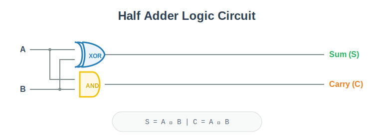
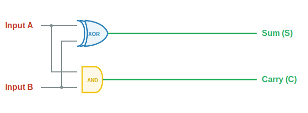
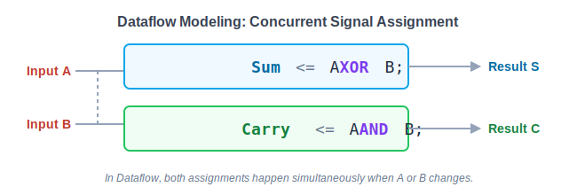
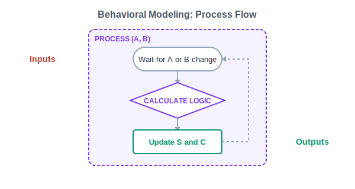
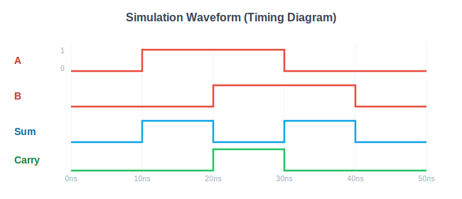

# 📘 VHDL Course – Lecture 1: Introduction to VHDL

Welcome to **Lecture 1** of this VHDL learning series.
This lecture is written for **absolute beginners** with no prior knowledge of VHDL or HDL.

---

## 🧠 What is HDL?

**HDL (Hardware Description Language)** is a language used to describe **digital hardware**, not software.

HDL is used to design:
- Logic gates
- Adders
- Registers
- Digital circuits

📌 HDL describes **how hardware behaves and how components are connected**.

---

## ⚙️ What is VHDL?

**VHDL** stands for:

> **Very High Speed Integrated Circuit Hardware Description Language**

VHDL is used to:
- Describe digital circuits
- Simulate circuit behavior
- Implement designs on FPGA or ASIC

---

## 🧱 VHDL Design Units

A VHDL design is built using **five design units**:

1. Entity
2. Architecture
3. Configuration
4. Package Declaration
5. Package Body

📌 In this lecture, we focus only on **Entity** and **Architecture**.

---

## 🏷️ Entity

The **entity** is the **external view** of a circuit.

Think of it as:
> The **nameplate** of the design

### The entity defines:
- Inputs
- Outputs
- Data type of each port

🔍 The entity **does NOT describe how the circuit works internally**.

### Entity Visualization

---

## 🧠 Architecture

The **architecture** describes the **internal behavior** of the circuit.

It explains:
- What happens inside the circuit
- How inputs are processed
- How outputs are generated

### Simple Explanation:
- **Entity → Outside view**
- **Architecture → Inside logic**

### Architecture Visualization

---

## 🔗 Entity & Architecture Relationship

- A VHDL design has **only one entity**
- A VHDL design can have **multiple architectures**

Why?
- Same interface
- Different internal implementations

### 🧩 Configuration
A **configuration** connects:
- An entity
- To a specific architecture

📌 Configurations will be covered in later lectures.

---

## ➕ Example: Half Adder

A **Half Adder** is a simple digital circuit.

It:
- Takes **two inputs**
- Produces:
  - **Sum**
  - **Carry**

### Half Adder Diagram

📌 We will implement this example in upcoming lectures.

---

## 🏗️ Architecture Modeling Styles

There are **three main ways** to describe an architecture in VHDL.

---

### 1️⃣ Structural Modeling
- Shows how components are connected
- Similar to circuit diagrams
- Used for **small designs**

---

### 2️⃣ Dataflow Modeling
- Describes how data flows from input to output
- Uses equations and signal assignments
- Simple and readable

---

### 3️⃣ Behavioral Modeling
- Describes **what the circuit does**
- Focuses on behavior, not structure
- Used for **complex designs**

---

## 🧪 Simulation Explanation

Simulation is used to **test the circuit before hardware implementation**.

A simulation waveform shows:
- Signals (inputs and outputs)
- Time axis
- Signal changes over time

### What to Look For in Simulation:
- Input signals changing (0 ↔ 1)
- Output signals responding correctly
- Correct timing behavior

### Simulation Waveform Example

💡 Simulation helps detect errors early and verify correctness.

---

## ✅ Summary

- VHDL is a hardware description language
- Entity defines inputs and outputs
- Architecture defines internal behavior
- One entity can have multiple architectures
- Simulation verifies design correctness

---